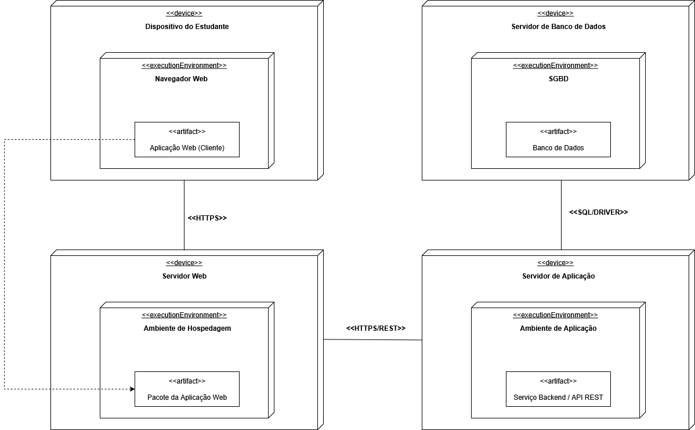

# Diagrama de Implantação 

## Introdução 

O diagrama de implantação, conforme definido pela UML (Unified Modeling Language), tem como finalidade representar a infraestrutura física e lógica de um sistema, evidenciando como os elementos de software são alocados nos diferentes dispositivos de hardware. Ele organiza de maneira visual a distribuição de aplicações, serviços e bancos de dados, além das conexões de comunicação entre eles.

Por ser independente de tecnologias específicas, esse diagrama pode ser aplicado a diversos contextos, incluindo sistemas web, corporativos ou acadêmicos. Sua principal utilidade é documentar a interação entre os componentes do cliente, do servidor e do banco de dados, fornecendo uma visão clara de onde cada parte do sistema será executada e como elas se conectam.

## Objetivo

O diagrama de implantação tem como objetivo representar a arquitetura física e lógica do sistema, destacando a interação entre os dispositivos do estudante, o servidor web, o servidor de aplicação e o servidor de banco de dados. 

Ele ilustra como os diferentes componentes de hardware e software estão distribuídos, como se comunicam entre si por meio de protocolos e quais são as responsabilidades de cada ambiente de execução.

Esse diagrama permite compreender a infraestrutura necessária para disponibilizar o sistema, garantindo clareza na relação entre as camadas de cliente, aplicação e persistência de dados, além de evidenciar aspectos de segurança, escalabilidade e organização tecnológica.

## Metodologia 

A construção desse diagrama de implantação segue as diretrizes da UML (Unified Modeling Language), fornecendo tanto uma notação padronizada representando os componentes de software, quanto suas interações no ambiente de execução do software. No desenvolvimento do Diagrama de Implantação foi utilizado a ferramenta draw.io. 

## Diagrama de Implantação

<b>Figura 1:</b> Diagrama de Implantação

<small><b>Fonte:</b>  Algusto Caldas, Eric Rabelo e Filipe Campelo</small>

## Descrição

O diagrama de implantação do sistema educacional é composto pelos seguintes componentes principais: Dispositivo do Estudante (Navegador Web), Servidor Web (Ambiente de Hospedagem), Servidor de Aplicação (Serviço Backend/API REST) e Servidor de Banco de Dados (SGBD). Esses elementos estão organizados de forma a permitir a interação eficiente entre usuário, aplicação e banco de dados, garantindo segurança, escalabilidade e desempenho.

- **Dispositivo do Estudante (Navegador Web)**:
Representa o ponto de acesso do usuário ao sistema. O navegador web hospeda a Aplicação Web (Cliente), que fornece a interface gráfica para interação com os estudantes. Toda comunicação com o servidor ocorre via protocolo HTTPS, garantindo a integridade e a segurança das informações transmitidas.

- **Servidor Web (Ambiente de Hospedagem)**:
É responsável por armazenar e servir o Pacote da Aplicação Web. Ele processa as requisições vindas do navegador, enviando arquivos estáticos (HTML, CSS, JavaScript) e gerenciando a comunicação com o Servidor de Aplicação através de HTTPS/REST. Atua como ponte entre a camada de interface e os serviços de backend.

- **Servidor de Aplicação (Serviço Backend / API REST)**:
Gerencia a lógica de negócios do sistema, implementando regras de autenticação, manipulação de dados e orquestração dos serviços. Ele recebe chamadas REST do servidor web, processa as requisições e interage com o banco de dados. Essa comunicação é realizada por meio de SQL/Driver, assegurando a persistência e a recuperação de dados.

- **Servidor de Banco de Dados (SGBD)**:
Armazena todas as informações do sistema no Banco de Dados. Esse componente é acessado pelo servidor de aplicação através de drivers SQL, permitindo operações CRUD (criação, leitura, atualização e exclusão). A camada de banco de dados garante consistência, integridade e segurança das informações dos estudantes e do sistema como um todo.

## Senso Crítico e Trabalho em Equipe

A construção do diagrama de implantação foi resultado de um trabalho colaborativo entre os integrantes da equipe, que se dedicaram a mapear a infraestrutura necessária para o funcionamento do sistema. Os membros da equipe contribuíram com reflexões sobre os componentes essenciais, avaliando a melhor forma de organizá-los e representá-los na modelagem.

No exercício do senso crítico, a equipe analisou tanto os aspectos de comunicação entre os elementos quanto as responsabilidades de cada camada, refletindo sobre protocolos, conexões e funções desempenhadas. Essa análise permitiu a inclusão de componentes relevantes e, também, a construção de uma visão mais clara sobre a interação entre hardware e software, reforçando a importância de decisões arquiteturais alinhadas às necessidades do sistema.

## Conclusão
O diagrama de implantação elaborado possibilita compreender de forma visual e estruturada a infraestrutura física e lógica que sustenta o sistema. Através dele, observa-se como os diferentes elementos se distribuem, desde o acesso do usuário no navegador, passando pelo servidor web e pelo backend, até o armazenamento de dados no banco, garantindo clareza sobre os papéis desempenhados em cada etapa da execução.

Ao utilizar a notação UML, a equipe conseguiu padronizar a representação dos componentes e conexões, o que facilita a comunicação entre desenvolvedores e demais interessados no projeto. Além disso, a análise crítica dos elementos envolvidos garante que o diagrama não seja apenas ilustrativo, mas que funcione como um guia para futuras etapas de desenvolvimento e implantação do sistema.

## Referências

> IBM. Diagramas de implementação. In: IBM Documentation. [s.l.]: IBM, c2011. Disponível em: https://www.ibm.com/docs/pt-br/rsas/7.5.0?topic=topologies-deployment-diagrams. Acesso em: 19 set. 2025.

> VISUAL PARADIGM. O que é Diagrama de Implantação? In: Visual Paradigm. [s.l.]: Visual Paradigm, c2024. Disponível em: https://www-visual--paradigm-com.translate.goog/guide/uml-unified-modeling-language/what-is-deployment-diagram/?_x_tr_sl=en&_x_tr_tl=pt. Acesso em: 19 set. 2025.

## Histórico de Versões

| Versão | Data | Descrição | Autor(es) | Revisor(es) | Detalhes da Revisão |
| -- | -- | -- | -- | -- | -- |
| 1.0 | 21/09/2025 | Criação do documento | [Felipe Campelo](https://github.com/felipeacampelo) | [Algusto Caldas](https://github.com/Algusto-RC)  | Sem erros |
| 1.1 | 21/09/2025 | Adição do Diagrama de Implantação | [Eric Rabelo](https://github.com/rabelzx) | [Algusto Caldas](https://github.com/Algusto-RC)  | Sem erros |
| 1.2 | 21/09/2025 | Adição das referências | [Algusto Caldas](https://github.com/Algusto-RC)  |  [Eric Rabelo](https://github.com/rabelzx)  | Sem erros |
| 1.3 | 21/09/2025 | Adição de Senso Crítico e Conclusão| [Felipe Campelo](https://github.com/felipeacampelo) | [Algusto Caldas](https://github.com/Algusto-RC) | |