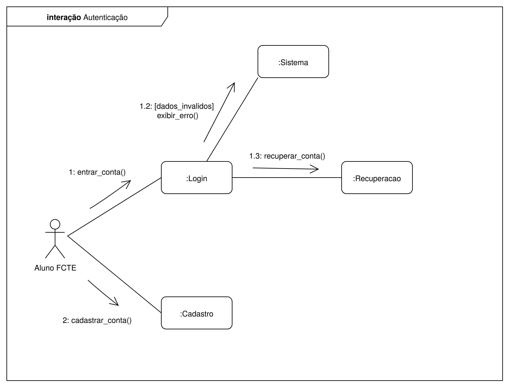
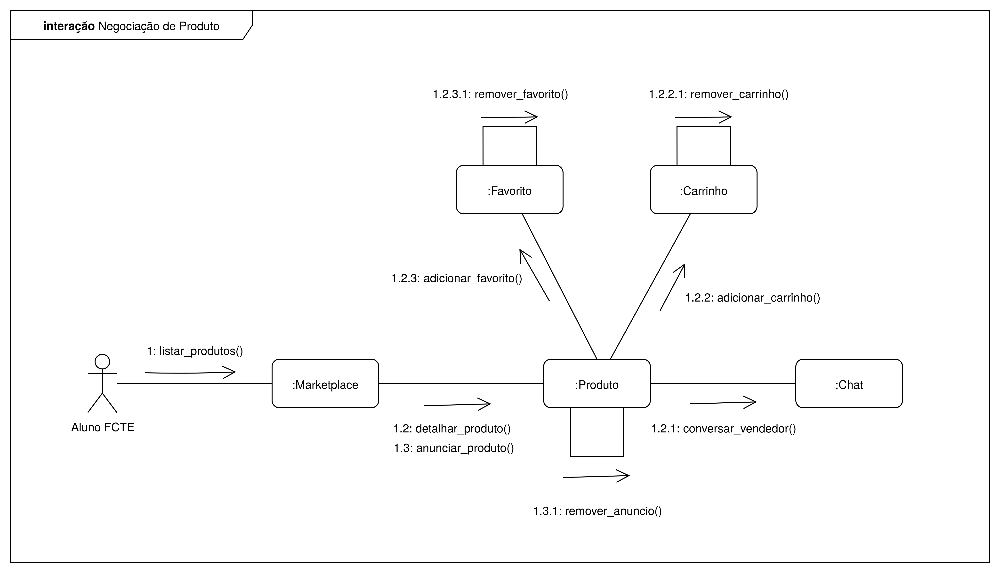

# 2.1.2. Diagrama de Colaboração

## Introdução

O diagrama de colaboração é um diagrama dinâmico da UML (Unified Modeling Language) que representa as interações entre objetos em um sistema durante a execução de um cenário específico. Este tipo de diagrama foca na estrutura organizacional dos objetos que colaboram para realizar uma funcionalidade, mostrando como as mensagens são trocadas entre eles ao longo do tempo. Diferentemente do diagrama de sequência, o diagrama de colaboração enfatiza a organização espacial dos objetos e suas associações, proporcionando uma visão mais clara da arquitetura de colaboração.

No contexto do desenvolvimento de software, os diagramas de colaboração são fundamentais para modelar comportamentos complexos do sistema, permitindo visualizar como diferentes componentes interagem para executar casos de uso específicos. Eles são especialmente úteis para documentar fluxos de trabalho, identificar responsabilidades de cada objeto e compreender as dependências entre os elementos do sistema. Através deste diagrama, desenvolvedores e stakeholders podem analisar a dinâmica das operações, facilitando a identificação de possíveis melhorias na arquitetura e na comunicação entre os componentes.

## Metodologia

Para o desenvolvimento dos diagramas de colaboração apresentados neste documento, foi adotada uma metodologia estruturada em cinco etapas principais, baseada nas melhores práticas de modelagem UML dinâmica e no trabalho colaborativo em equipe.

**Etapa 1 - Análise de Requisitos e Casos de Uso:** Inicialmente, a equipe de quatro integrantes realizou uma análise detalhada dos casos de uso do sistema AquiTemFCTE, identificando os principais cenários de interação que seriam modelados através dos diagramas de colaboração. Foram selecionados dois cenários críticos: o processo de autenticação de usuários e o fluxo de negociação de produtos, por representarem funcionalidades essenciais do sistema.

**Etapa 2 - Identificação de Objetos e Responsabilidades:** Com base nos casos de uso selecionados, a equipe identificou os objetos participantes em cada cenário, definindo suas responsabilidades e as mensagens que seriam trocadas entre eles. Esta etapa seguiu os princípios de orientação a objetos, garantindo que cada objeto tivesse responsabilidades bem definidas e coesas.

**Etapa 3 - Elaboração Colaborativa:** Utilizando a plataforma Draw.io, a equipe trabalhou de forma colaborativa na criação dos diagramas. A ferramenta permitiu que os quatro integrantes contribuíssem simultaneamente, facilitando a discussão e o refinamento dos modelos em tempo real. A escolha do Draw.io se justifica por sua interface intuitiva, suporte nativo à notação UML e capacidades de colaboração em tempo real.

**Etapa 4 - Validação e Refinamento:** Cada diagrama foi submetido a sessões de revisão pela equipe, onde foram verificados aspectos como: conformidade com a notação UML 2.0, completude das interações modeladas, consistência com os casos de uso originais e clareza da representação visual. Esta etapa seguiu as diretrizes estabelecidas por Larman (2007) para validação de diagramas de interação.

**Etapa 5 - Documentação Final:** Por fim, os diagramas foram organizados neste documento, acompanhados de suas respectivas legendas e fontes, seguindo padrões acadêmicos de documentação técnica. A metodologia adotada está alinhada com as práticas recomendadas por Fowler (2003) para modelagem UML em projetos de software.

## Diagrama - Autenticação

<b>Figura 1:</b> Diagrama de Colaboração para a Autenticação

<b>Fonte:</b> Lucas Guimarães, Caio Sabino, Daniel Rodrigues, Felipe Campelo

O diagrama de colaboração da Figura 1 ilustra o fluxo de interação do usuário, aqui representado pelo ator "Aluno FCTE", com o processo de autenticação do sistema. Este cenário garante o acesso seguro à plataforma. A interação é iniciada pelo aluno e se desdobra em três possíveis caminhos principais, orquestrados por quatro objetos colaboradores: `:Login`, `:Cadastro`, `:Sistema` e `:Recuperacao`.

O fluxo se desenvolve da seguinte forma:
Ações Iniciais do Usuário: O "Aluno FCTE" inicia a interação e pode optar por duas ações primárias:

- 1: `entrar_conta()`: O aluno tenta fazer login, enviando uma mensagem para o objeto `:Login`.

- 2: `cadastrar_conta()`: O aluno opta por se registrar, enviando uma mensagem para o objeto `:Cadastro`, que tratará da criação de um novo perfil.

Processamento do Login: Após a primeira ação (`entrar_conta()`), o objeto `:Login` processa as credenciais fornecidas. A partir daqui, a interação pode seguir dois caminhos distintos:

- 1.2: [dados_invalidos] exibir_erro(): Caso as credenciais fornecidas pelo aluno sejam inválidas, o objeto `:Login` envia uma mensagem `exibir_erro()` para o objeto `:Sistema`. A condição [dados_invalidos] indica que esta mensagem só é disparada se a validação falhar. O objeto `:Sistema` fica então responsável por apresentar a mensagem de erro ao usuário.

- 1.3: `recuperar_conta()`: Se o aluno não se lembra de seus dados e solicita a recuperação da conta (uma ação implícita na tela de login), o objeto :Login envia a mensagem `recuperar_conta()` para o objeto `:Recuperacao`, que dará início ao fluxo de redefinição de senha ou recuperação de nome de usuário.

## Diagrama - Negociação de Produto

<b>Figura 2:</b> Diagrama de Neogicação de Produto

<b>Fonte:</b> Lucas Guimarães, Caio Sabino, Daniel Rodrigues, Felipe Campelo

O diagrama da Figura 2 modela o cenário de negociação e interação com produtos na plataforma, um dos fluxos mais importantes do sistema AquiTemFCTE. O ator "Aluno FCTE" interage com um conjunto de objetos para visualizar, gerenciar e anunciar produtos. Os principais colaboradores neste processo são `:Marketplace`, `:Produto`, `:Chat`, `:Carrinho` e `:Favorito`.

O fluxo de interação é descrito a seguir:

- 1:` listar_produtos()`: A interação começa quando o "Aluno FCTE" solicita a lista de produtos disponíveis, enviando uma mensagem ao objeto `:Marketplace`. Este objeto atua como a fachada principal para a exploração de itens na plataforma.

Interações a partir do Marketplace: Uma vez que os produtos são listados, o `:Marketplace` pode originar duas operações principais sobre um objeto :Produto:

- 1.2: `detalhar_produto()`: Quando o aluno seleciona um item para ver mais informações, o `:Marketplace` envia uma mensagem para o objeto `:Produto` correspondente.

- 1.3: `anunciar_produto()`: Se o aluno deseja vender um item, o `:Marketplace` envia uma mensagem para criar um novo anúncio, representado também pelo objeto `:Produto`.

Ações sobre um Produto Detalhado: Após a chamada de `detalhar_produto()` (1.2), o aluno pode realizar várias ações a partir do objeto `:Produto`:

- 1.2.1: `conversar_vendedor()`: Para iniciar uma negociação ou tirar dúvidas, o objeto `:Produto` envia uma mensagem para o objeto `:Chat`, estabelecendo a comunicação entre o comprador e o vendedor.

- 1.2.2: `adicionar_carrinho()`: O aluno adiciona o item ao seu carrinho de compras. O objeto `:Produto` envia uma mensagem para o objeto `:Carrinho`. Subsequentemente, o próprio objeto `:Carrinho` pode executar a ação 1.2.2.1: `remover_carrinho()`, caso o aluno desista da compra.

- 1.2.3: `adicionar_favorito()`: O aluno marca o produto como favorito, fazendo com que o objeto `:Produto` envie uma mensagem para o objeto `:Favorito`. De forma similar, o objeto `:Favorito` pode depois executar a ação 1.2.3.1: `remover_favorito()`.

Ações sobre um Anúncio Criado: Após a chamada de `anunciar_produto()` (1.3), o dono do anúncio pode gerenciá-lo:

- 1.3.1:` remover_anuncio()`: O aluno que criou o anúncio pode removê-lo. Esta é uma mensagem enviada ao próprio objeto :Produto para alterar seu estado ou removê-lo do sistema.

Este diagrama demonstra a rica colaboração entre os objetos para fornecer uma experiência de negociação completa, desde a descoberta de produtos até a interação direta com o vendedor e o gerenciamento de itens de interesse.

## Senso Crítico e Trabalho em Equipe

O desenvolvimento dos diagramas de colaboração apresentados neste documento representou um desafio significativo que exigiu coordenação efetiva entre os quatro membros da equipe: Lucas Guimarães, Caio Sabino, Daniel Rodrigues e Felipe Campelo. Durante o processo de criação, emergiram diversos pontos que merecem reflexão crítica sobre a experiência de trabalho colaborativo e os resultados obtidos.

**Desafios Enfrentados:** Um dos principais desafios identificados foi a necessidade de consenso na definição dos objetos participantes e suas responsabilidades. Inicialmente, houve divergências sobre o nível de granularidade adequado para os diagramas - alguns membros da equipe propunham uma abordagem mais detalhada, enquanto outros defendiam uma visão mais abstrata. Essa tensão foi fundamental para alcançar um equilíbrio que resultou em diagramas informativos, mas sem serem excessivamente complexos. Outro aspecto desafiador foi a sincronização do trabalho na plataforma Draw.io, especialmente durante as sessões de edição simultânea, que exigiu uma comunicação constante e estabelecimento de convenções claras de nomenclatura e estilo.

**Aspectos Positivos da Colaboração:** A diversidade de perspectivas da equipe enriqueceu significativamente o produto final. Cada membro trouxe uma visão única sobre o sistema AquiTemFCTE, contribuindo para identificar interações que poderiam ter passado despercebidas em um trabalho individual. A utilização do Draw.io como ferramenta colaborativa provou ser uma escolha acertada, permitindo revisões em tempo real e facilitando o processo de refinamento iterativo dos diagramas. A divisão natural de responsabilidades emergiu organicamente, com alguns membros focando mais na estrutura dos objetos e outros nas sequências de mensagens, demonstrando a importância da complementaridade de habilidades em projetos de modelagem.

**Reflexões sobre o Processo:** Retrospectivamente, a equipe reconhece que a fase inicial de planejamento poderia ter sido mais estruturada, com definições mais claras sobre padrões de nomenclatura e critérios de validação desde o início. No entanto, essa experiência de aprendizado contribuiu para um melhor entendimento sobre a importância da comunicação clara e da documentação de decisões de design. O processo colaborativo também revelou a necessidade de balancear diferentes níveis de experiência em UML dentro da equipe, resultando em sessões de nivelamento que beneficiaram a todos os participantes.

## Conclusão

Os diagramas de colaboração desenvolvidos para o sistema AquiTemFCTE demonstram a importância fundamental da modelagem dinâmica na compreensão e documentação de sistemas de software complexos. Através da representação visual das interações entre objetos nos cenários de autenticação e negociação de produtos, foi possível capturar aspectos críticos do comportamento do sistema que são essenciais para o desenvolvimento e manutenção da aplicação.

A criação destes diagramas proporcionou diversos benefícios tangíveis para o projeto. Primeiro, eles serviram como uma ferramenta de comunicação eficaz entre os membros da equipe, estabelecendo uma linguagem comum para discussão da arquitetura do sistema. Segundo, a modelagem revelou dependências e responsabilidades entre os componentes que não eram evidentes na documentação textual dos requisitos, contribuindo para uma melhor compreensão da complexidade inerente aos fluxos de negócio. Terceiro, os diagramas funcionam como uma base sólida para futuras atividades de desenvolvimento, fornecendo um mapeamento claro das interações necessárias para implementar as funcionalidades modeladas.

Além dos benefícios técnicos, o processo de desenvolvimento colaborativo dos diagramas fortaleceu as competências da equipe em trabalho conjunto e modelagem UML. A experiência demonstrou que a qualidade dos artefatos de modelagem está diretamente relacionada à efetividade da colaboração entre os participantes, evidenciando a importância de metodologias estruturadas e ferramentas adequadas para o trabalho em equipe.

## Referências:

> FOWLER, Martin. UML Distilled: A Brief Guide to the Standard Object Modeling Language. 3rd ed. Boston: Addison-Wesley Professional, 2003.

> KIRILL FAKHROUTDINOV. UML communication diagrams overview - graphical notations for lifeline, message, etc. Disponível em: <https://www.uml-diagrams.org/communication-diagrams.html>. Acesso em 20 de setembro de 2025.

> LARMAN, Craig. Utilizando UML e Padrões: Uma Introdução à Análise e ao Projeto Orientados a Objetos e ao Desenvolvimento Iterativo. 3ª ed. Porto Alegre: Bookman, 2007.

> SERRANO, Milene, Arquitetura e Desenho de Software - Aula - Modelagem UML Dinâmica. Disponível em: https://aprender3.unb.br/pluginfile.php/3178534/mod_page/content/1/Arquitetura%20e%20Desenho%20de%20Software%20-%20Aula%20Modelagem%20UML%20Din%C3%A2mica%20-%20Profa.%20Milene.pdf. Universidade de Brasília - UnB. Brasília. Acesso em 20 de setembro de 2025.

## Histórico de Versões

| Versão | Data | Descrição | Autor(es) | Revisor(es) | Detalhes da Revisão |
| ------ | ---- | --------- | --------- | ----------- | ------------------- |
| 1.0    | 21/09/2025 | Adicionar tópico de Introdução e Metodologia | [Daniel Rodrigues](https://github.com/DanielRogs) | [Felipe de Aquino](https://github.com/felipeacampelo) | Alterações alinhadas e sem nenhum erro identificado |
| 1.1    | 21/09/2025 | Adicionar tópico de Diagramas                | [Daniel Rodrigues](https://github.com/DanielRogs) | [Caio Sabino](https://github.com/caiomsabino) | Alterações alinhadas e sem nenhum erro identificado |
| 1.2    | 21/09/2025 | Adicionar senso crítico, conclusão e referencias | [Daniel Rodrigues](https://github.com/DanielRogs) | [Lucas Guimarães](https://github.com/lcsgborges) | Alterações alinhadas e sem nenhum erro identificado |
