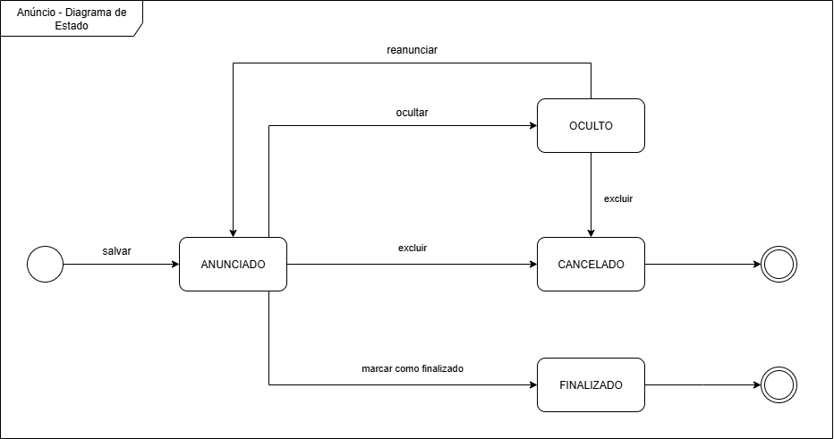
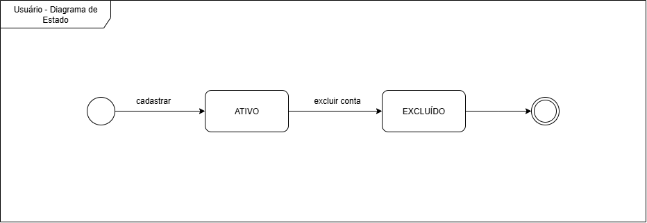
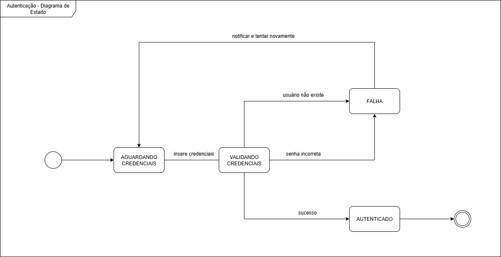
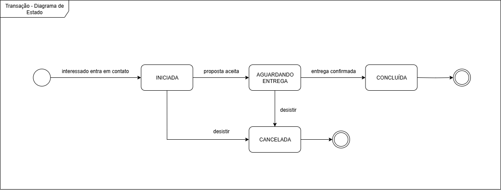
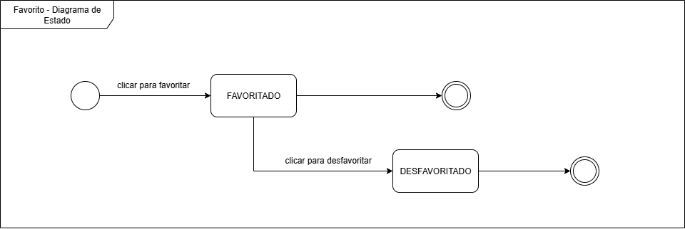

# 2.2.2. Diagrama de Estados

## Introdução

O diagrama de estados é definido como um diagrama dinâmico da UML, sendo utilizado para modelar o ciclo de vida de um objeto no sistema. Ele é responsável por mostrar os diversos estados pelos quais um objeto pode passar, tal como os eventos internos ou externos ao sistema que provocam a transição entre esses estados. Essa forma de representação é particularmente vantajosa para compreender comportamentos reativos e assegurar consistência nas interações com os componentes da aplicação.

A modelagem do diagrama de estados apoia a definição das regras de negócio, a identificação antecipada de possíveis exceções de uso e o gerenciamento de transições críticas, como login e envio de dados. Além disso, esclarece o comportamento esperado de elementos interativos, favorecendo um design mais confiável e previsível, e por consequência, auxiliando a equipe durante a construção do projeto.

## Metodologia

Para a elaboração do diagrama de estados do projeto, os integrantes responsáveis se basearam nos fluxos identificados durante o Design Sprint, como também nos requisitos funcionais obtidos a partir do [protótipo de alta fidelidade](https://www.figma.com/design/yObjBzXZLS32lHWGcwTUe7/Prototipo-AquiTemFCTE?node-id=0-1&t=5owHX4OWhRrvVHMI-1) desenvolvido na entrega 1. A partir disso, foram representados, seguindo os padrões da UML, os ciclos de interação do usuário com as funcionalidades de anunciar um produto, cadastrar um perfil, negociar um produto e favoritar produto com o auxílio da ferramenta colaborativa Draw.io.
## Diagrama

O diagrama de estados contempla os seguintes ciclos de vida principais de interação na aplicação AquiTemFCTE:

### Diagrama de Estado: Anúncio

  
<b>Figura 1:</b> Diagrama de Estado - Anúncio

  
  
<small><b>Fonte:</b> Algusto Caldas, Davi Camilo e Eric Rabelo</small>

#### Descrição do Diagrama de Estado: Anúncio

O diagrama da Figura 1 modela o ciclo de vida de um **Anúncio** dentro da plataforma AquiTemFCTE. Ele define os diferentes estados que um anúncio pode assumir desde sua criação até sua conclusão ou remoção, refletindo as ações que o usuário anunciante pode realizar.

* **Criação e Estado `ANUNCIADO`**: O ciclo se inicia quando um usuário cria e `salva` um novo anúncio, que entra imediatamente no estado `ANUNCIADO`. Neste estado, o item está público, visível para os demais estudantes e disponível para negociação.

* **Estado `OCULTO`**: A partir do estado `ANUNCIADO`, o criador do anúncio pode optar por `ocultar` sua publicação. No estado `OCULTO`, o anúncio fica temporariamente indisponível para o público, mas não é removido do sistema. Isso permite que o usuário possa `reanunciar` o item a qualquer momento, fazendo-o retornar ao estado `ANUNCIADO`.

* **Estados Finais (`FINALIZADO` e `CANCELADO`)**: O ciclo de vida de um anúncio pode terminar de duas maneiras:
    * **`FINALIZADO`**: Quando uma negociação (venda ou troca) é bem-sucedida, o usuário deve `marcar como finalizado` o anúncio. Este é um estado terminal que indica a conclusão com sucesso do propósito do anúncio.
    * **`CANCELADO`**: Se o usuário desejar remover permanentemente sua publicação, ele pode usar a ação `excluir`. Este estado pode ser alcançado tanto de `ANUNCIADO` quanto de `OCULTO`, e também representa o fim do ciclo de vida do anúncio.

### Diagrama de Estado: Usuário

  
<b>Figura 2:</b> Diagrama de Estado - Usuário

  
  
<small><b>Fonte:</b> Algusto Caldas, Davi Camilo e Eric Rabelo</small>

#### Descrição do Diagrama: Usuário 

O diagrama da Figura 2 ilustra o ciclo de vida de uma conta de **Usuário** na plataforma AquiTemFCTE. Este modelo representa um fluxo simplificado, focando nos eventos essenciais de criação e remoção da conta, que são os pontos de início e fim da jornada de um usuário no sistema.

* **Criação e Estado `ATIVO`**: O ciclo de vida de um usuário começa com a ação `cadastrar`. Ao se cadastrar, a conta é imediatamente criada e entra no estado `ATIVO`. Neste estado, o usuário é considerado um membro válido da plataforma, com permissão para realizar ações como criar anúncios, favoritar itens e iniciar transações.

* **Estado Final `EXCLUÍDO`**: O estado `ATIVO` é o único estado funcional do ciclo de vida. A partir dele, a única transição possível é através da ação `excluir conta`. Esta ação, iniciada pelo próprio usuário, move a conta para o estado terminal `EXCLUÍDO`, representando a remoção permanente do usuário do sistema e encerrando seu ciclo de vida na plataforma.
### Diagrama de Estado: Autenticação

  
<b>Figura 3:</b> Diagrama de Estado - Autenticação

  
  
<small><b>Fonte:</b> Algusto Caldas, Davi Camilo e Eric Rabelo</small>

#### Descrição do Diagrama: Autenticação

O diagrama da Figura 3 detalha o ciclo de vida de uma **Tentativa de Autenticação** no sistema, modelado como um diagrama de estados. Ele descreve o comportamento do sistema desde o momento em que o usuário acessa a tela de login até o resultado final da sua tentativa, seja sucesso ou falha.

* **Início e Validação**: O processo se inicia no estado `AGUARDANDO CREDENCIAIS`, onde o sistema espera pela entrada do usuário. Após a submissão das credenciais, a tentativa de login transita para o estado `VALIDANDO CREDENCIAIS`, que representa a execução da lógica de verificação no backend.

* **Lógica de Segurança e o Estado `FALHA`**: A partir da validação, existem três resultados possíveis. O resultado de `sucesso` leva ao estado final `AUTENTICADO`. No entanto, para garantir a segurança e evitar a vulnerabilidade de "Enumeração de Usuário", tanto o resultado de `usuário não existe` quanto o de `senha incorreta` levam para o **mesmo e único estado de `FALHA`**. Esta é uma decisão de design crucial para não expor informações sobre quais e-mails estão ou não cadastrados na plataforma.

* **Ciclo de Tentativa e Sucesso**: Ao entrar no estado `FALHA`, o usuário recebe uma notificação de erro genérica e o sistema retorna ao estado `AGUARDANDO CREDENCIAIS`, permitindo uma nova tentativa. Caso a validação seja bem-sucedida, a tentativa de login alcança o estado terminal `AUTENTICADO`, que representa o acesso concedido e o fim do processo de autenticação.

### Diagrama de Estado: Transação

  
<b>Figura 4:</b> Diagrama de Estado - Transação

  
  
<small><b>Fonte:</b> Algusto Caldas, Davi Camilo e Eric Rabelo</small>

#### Descrição do Diagrama: Transação

O diagrama da Figura 4 modela o ciclo de vida da **Transação**, a entidade que representa o processo de negociação e acordo entre dois usuários sobre um anúncio específico. Este fluxo é central para a plataforma, pois formaliza a interação de compra, venda ou troca.

* **Início da Negociação**: O ciclo se inicia quando um `interessado entra em contato` a respeito de um anúncio, criando uma nova transação no estado `INICIADA`. Este estado representa a fase de negociação e conversa entre as partes.

* **Acordo e Entrega**: Quando um acordo é alcançado, o evento `proposta aceita` move a transação para o estado `AGUARDANDO ENTREGA`. Nesta fase, a negociação verbal foi concluída com sucesso e o sistema aguarda a confirmação de que o encontro físico e a troca do item foram de fato realizados.

* **Conclusão e Cancelamento**: O ciclo de vida da transação possui dois possíveis desfechos:
    * **`CONCLUÍDA`**: Após a `entrega confirmada`, a transação atinge seu estado final de sucesso, indicando que a troca foi efetuada e o processo terminou bem.
    * **`CANCELADA`**: Se a qualquer momento antes da conclusão uma das partes `desistir` do acordo, a transação é movida para o estado terminal `CANCELADA`, encerrando o fluxo sem que a troca tenha sido efetivada.

### Diagrama de Estado: Favorito

  
<b>Figura 5:</b> Diagrama de Estado - Favorito

  
  
<small><b>Fonte:</b> Algusto Caldas, Davi Camilo e Eric Rabelo</small>

#### Descrição do Diagrama: Favorito

O diagrama da Figura 5 descreve o ciclo de vida da ação de **Favoritar** um anúncio. Diferente das outras entidades, este modelo representa uma interação de curta duração, focada na decisão do usuário de marcar ou desmarcar um item como favorito.

* **Criação do Favorito**: O ciclo se inicia quando o usuário `clica para favoritar` um anúncio. Esta ação cria a relação de favoritismo e a coloca no estado `FAVORITADO`. Neste modelo, este é um estado terminal, representando a conclusão bem-sucedida da ação de adicionar um item à lista de favoritos.

* **Remoção do Favorito**: Caso o usuário já tenha favoritado um item, ele tem a opção de `clicar para desfavoritar`. Esta ação move a relação para o estado `DESFAVORITADO`, que também é um estado terminal, indicando que o ciclo de vida daquela "marcação" foi encerrado pela remoção.

A estrutura com dois estados finais indica que o modelo trata a ação de favoritar e a subsequente ação de desfavoritar como eventos que levam o ciclo a uma conclusão definitiva, em vez de um estado que alterna continuamente.

## Senso Crítico e Trabalho em Equipe

Os integrantes encarregados pelo artefato trabalharam em conjunto para a construção de bons fluxos de um diagrama de estado, buscando incluir os principais elementos necessários para o sistema, os quais foram identificados na entrega 1 do projeto. Sobre o senso crítico, a equipe analisou os principais ciclos de interação do usuário, onde, após refletirem, cada integrante incorporou as ideias em fluxos do diagrama, buscando sempre manter coesão com o previsto para a aplicação.

## Conclusão

O diagrama de estados possibilita a representação dos ciclos de vida dos objetos nas principais interações do sistema, oferecendo clareza quanto aos comportamentos esperados em diferentes situações, principalmente as que envolvem o usuário. Junto a isso, o uso da notação UML padroniza a comunicação entre os membros da equipe, favorecendo a definição de fluxos mais consistentes e confiáveis.

Ao analisar os diversos eventos que envolvem transições entre estados intermediários de cada funcionalidade, essa modelagem aumenta a robustez do sistema, permitindo antecipar exceções e assegurar uma experiência mais estável aos usuários, bem como auxiliar a equipe de desenvolvimento em múltiplas situações.

## Referências

> SERRANO, Milene, Arquitetura e Desenho de Software - Aula - Modelagem UML Dinâmica. Universidade de Brasília - UnB. Brasília. Acesso em 20 de setembro de 2025.

> SERRANO, Milene. 06d – VideoAula – DSW-Modelagem – Estados. [S. l.: s. n.], 28 jul. 2020. 1 vídeo (11 min). Acesso em: 21 set. 2025.

> SERRANO, Milene. Authentication – state diagram. [Material suplementar da aula de modelagem UML dinâmica]. [S. l.: s. n.], 2020. 1. Acesso em: 21 set. 2025.

## Histórico de Versões
| Versão | Data | Descrição | Autor(es) | Revisor(es) | Detalhes da Revisão |
| -- | -- | -- | -- | -- | -- |
| 1.0 | 20/09/2025 | Desenvolvimento inicial do documento (com todos os tópicos) | [Davi Camilo](https://github.com/Davicamilo23) | [Eric Rabelo](https://github.com/rabelzx) | 20/09/2025 |
| 1.1 | 20/09/2025 | Correção do tamanho da legenda (fonte) dos diagramas | [Davi Camilo](https://github.com/Davicamilo23) | [Eric Rabelo](https://github.com/rabelzx) | 20/09/2025 |
| 1.2 | 20/09/2025 | Adiciona a seção de "Senso Crítico e Trabalho em Equipe" | [Davi Camilo](https://github.com/Davicamilo23) | [Eric Rabelo](https://github.com/rabelzx) | 20/09/2025 |
| 1.3 | 21/09/2025 | Desenvolvimento do senso crítico e trabalho em equipe e da conclusão | [Davi Camilo](https://github.com/Davicamilo23) | [Algusto Caldas](https://github.com/Algusto-RC) | 21/09/2025 |
| 1.4 | 21/09/2025 | Adição das imagens dos diagramas de estado | [Algusto Caldas](https://github.com/Algusto-RC) | [Eric Rabelo](https://github.com/rabelzx) | 21/09/2025 |
| 1.5 | 21/09/2025 | Adição da descrição dos diagramas de estado | [Eric Rabelo](https://github.com/rabelzx) | [Algusto Caldas](https://github.com/Algusto-RC) | 21/09/2025 |